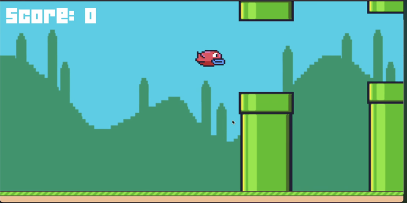

# Flappy Bird

A LÖVE2D recreation of the popular mobile game, made as part of CS50's Game Development course.



## Description

Flappy Bird is a side-scrolling action game featuring one-button gameplay, procedurally generated pipes, and a physics-based bird. This project explores game loops, object-oriented Lua programming, and state machines.

Features include:

- One-button gameplay with jump physics
- Procedurally generated pipe obstacles
- Collision detection between bird and pipes
- Scoring and medal system
- Pause functionality and multiple game states

## How to Play

### Controls

- `Spacebar`: Make the bird flap/jump
- `P`: Pause or unpause the game

### Objective

Fly between the pipes for as long as you can. Score 1 point for each pipe gap you pass through. The game ends when you hit a pipe or the ground.

## Development

### Built With

- [LÖVE2D](https://love2d.org/) — Framework for 2D game development
- Lua — Programming language
- Object-Oriented Lua using a class library
- Custom state machine implementation

### Project Structure

- `main.lua` — Game loop and setup
- `Bird.lua` — Bird behavior and animation
- `Pipe.lua` / `PipePair.lua` — Pipe logic and spawning
- `StateMachine.lua` — Core game state manager
- `states/` — Folder for all game state files
- `push.lua` — Virtual resolution handler
- `*.png`, `*.wav`, `*.mp3`, `*.ttf` — Assets (sprites, sounds, fonts)

## Installation and Running

1. [Download and install LÖVE2D](https://love2d.org/)
2. Clone the repo:
   ```bash
   git clone https://github.com/ethanperello/flappy-bird.git
   ```
3. Run the game:
   ```bash
   love flappy-bird
   ```

## Demo

[Watch the gameplay demo](https://www.youtube.com/watch?v=cguqEUa7aKc)

## Credits

- Developed by Ethan Perello  
- Created as part of CS50's Game Development course  
- Sound and sprite assets inspired by the original Flappy Bird
